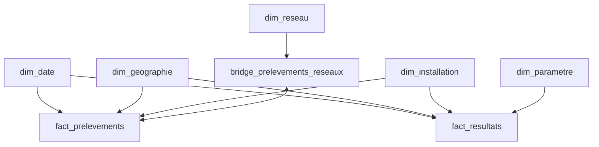

# Intégration du modèle analytique BigQuery dans Power BI

## 1. Objectif

Cette étape assure la transition entre la couche analytique construite avec **BigQuery et dbt** et la couche de restitution réalisée avec **Power BI**.

L'objectif n'est pas de reproduire dans Power BI les transformations déjà réalisées avec dbt.

La séparation des responsabilités retenue dans le projet est :

```text
API Hub'Eau
     ↓
Python
     ↓
BigQuery RAW
     ↓
dbt
     ↓
STG → ODS → DIM / FACT
                  ↓
               Power BI
                  ↓
          Modèle sémantique
                  ↓
                 DAX
                  ↓
              Dashboard
```

Ainsi :

- **Python** assure l'extraction et l'ingestion des données ;
- **BigQuery** assure le stockage ;
- **dbt** assure la transformation, la modélisation et les contrôles de qualité ;
- **Power BI** consomme directement la couche analytique finale et assure le modèle sémantique, les mesures DAX et la visualisation.

Cette organisation évite de dupliquer dans Power Query des transformations déjà réalisées en amont.

---

## 2. Connexion de Power BI à BigQuery

Power BI Desktop est connecté au projet Google Cloud contenant les modèles analytiques produits par dbt.

Les données sont accessibles dans plusieurs datasets correspondant aux différentes couches du pipeline :

```text
BigQuery
│
├── hubeau_raw
├── hubeau_stg
├── hubeau_ods
├── hubeau_dim
└── hubeau_fact
```

Power BI ne consomme volontairement que les deux dernières couches :

```text
hubeau_dim
hubeau_fact
```

Les couches suivantes ne sont donc pas importées dans Power BI :

```text
hubeau_raw   ❌
hubeau_stg   ❌
hubeau_ods   ❌
```

Cette décision permet de conserver une séparation claire entre :

```text
Préparation / transformation des données
                ↓
          BigQuery + dbt

Analyse / restitution
                ↓
             Power BI
```

---

## 3. Tables importées

Huit tables analytiques sont intégrées dans Power BI.

### Dimensions

```text
dim_date
dim_geographie
dim_installation
dim_parametre
dim_reseau
```

### Faits

```text
fact_prelevements
fact_resultats
```

### Bridge

```text
bridge_prelevements_reseaux
```

Le modèle Power BI s'appuie ainsi directement sur le modèle analytique produit par dbt.

---

## 4. Choix du mode de connexion

Le mode **Import** est retenu plutôt que `DirectQuery`.

Le volume de données du projet reste suffisamment limité pour permettre une importation efficace dans le modèle Power BI.

Le fonctionnement retenu est donc :

```text
BigQuery
    ↓
Import
    ↓
Modèle Power BI
    ↓
DAX
    ↓
Visualisations
```

Ce choix permet notamment :

- des interactions rapides dans le dashboard ;
- de limiter les requêtes BigQuery déclenchées lors de l'utilisation du rapport ;
- de simplifier le modèle Power BI ;
- de conserver BigQuery et dbt comme source analytique de référence.

Lorsque les données BigQuery évoluent, le modèle Power BI peut être actualisé.

---

## 5. Contrôle des types après import

Avant de charger définitivement les données dans le modèle Power BI, les huit tables ont été contrôlées dans **Power Query**.

L'objectif n'était pas de transformer les données, mais de vérifier que les types BigQuery étaient correctement interprétés par Power BI.

Les principaux types rencontrés sont :

```text
ABC  → Texte
123  → Nombre entier
1.2  → Nombre décimal
Date → Date
Date/Heure → Date et heure
```

Aucune transformation corrective majeure n'a été nécessaire.

---

## 6. Conservation des identifiants sous forme de texte

Plusieurs identifiants ressemblent visuellement à des nombres.

Exemples :

```text
code_parametre
code_prelevement
code_reseau
code_commune
code_departement
code_installation_amont
code_unite
```

Ils sont néanmoins conservés en **texte**.

Par exemple :

```text
code_installation_amont = 045000729
```

ne représente pas une quantité numérique mais un identifiant métier.

Une conversion en nombre pourrait notamment supprimer le zéro initial :

```text
045000729
    ↓
45000729
```

Les identifiants restent donc volontairement typés comme texte dans Power BI.

---

## 7. Contrôle de `fact_resultats`

La table `fact_resultats` conserve correctement les différents types nécessaires à l'analyse.

Les identifiants sont en texte :

```text
code_prelevement
code_parametre
code_lieu_analyse
reference_analyse
code_commune
code_installation_amont
```

Les informations temporelles sont correctement reconnues :

```text
date_prelevement       → Date
date_heure_prelevement → Date/Heure
```

Les valeurs numériques sont reconnues comme nombres décimaux :

```text
resultat_numerique
seuil_resultat

valeur_min_limite_qualite
valeur_max_limite_qualite

valeur_min_reference_qualite
valeur_max_reference_qualite
```

Les informations alphanumériques restent en texte :

```text
resultat_alphanumerique
operateur_resultat

limite_qualite_parametre
operateur_min_limite_qualite
operateur_max_limite_qualite
unite_limite_qualite

reference_qualite_parametre
operateur_min_reference_qualite
operateur_max_reference_qualite
unite_reference_qualite
```

Cette séparation est importante pour les futures analyses Power BI, notamment pour distinguer :

```text
Valeur directe
Résultat censuré "<x"
N.M.
```

---

## 8. Contrôle de `fact_prelevements`

La table `fact_prelevements` conserve :

```text
code_prelevement                → Texte
date_prelevement                → Date
date_heure_prelevement          → Date/Heure
code_commune                    → Texte
code_installation_amont         → Texte
```

Les informations de conformité restent également en texte :

```text
conclusion_conformite_prelevement

conformite_limites_bact_prelevement
conformite_limites_pc_prelevement

conformite_references_bact_prelevement
conformite_references_pc_prelevement
```

Ces champs seront notamment utilisés pour les indicateurs de la Page 1 du dashboard.

---

## 9. Contrôle des dimensions

Les dimensions sont également correctement interprétées par Power BI.

### `dim_date`

Les champs calendaires sont correctement différenciés :

```text
date             → Date
annee            → Entier
trimestre        → Entier
numero_mois      → Entier
nom_mois         → Texte
annee_mois       → Texte
jour_mois        → Entier
jour_semaine     → Entier
nom_jour_semaine → Texte
```

La présence simultanée de `numero_mois` et `nom_mois` permettra notamment de contrôler correctement l'ordre d'affichage des mois dans Power BI.

### `dim_parametre`

Les codes, libellés et unités restent en texte.

Cette dimension permettra notamment d'utiliser dans les visualisations les libellés métier plutôt que les codes techniques.

### `dim_installation`

Le code et le nom de l'installation restent en texte.

### `dim_geographie`

Les codes géographiques sont également conservés sous forme de texte.

### `dim_reseau`

`code_reseau` reste en texte.

La colonne `noms_reseau` est reconnue par Power Query comme une **liste**.

Cette structure provient du modèle dbt, qui conserve les différentes appellations historiques observées pour un même réseau.

La liste n'est pas développée dans Power Query afin de préserver le grain de la dimension :

> **1 ligne = 1 code réseau**

Développer cette liste pourrait créer plusieurs lignes pour un même réseau et modifier le grain de `dim_reseau`.

---

# 10. Construction du modèle relationnel Power BI

Après le contrôle des types, les relations du modèle Power BI ont été vérifiées.

Les relations générées automatiquement par Power BI ne sont pas considérées comme correctes par défaut.

Elles sont contrôlées selon :

- le grain des tables ;
- la cardinalité attendue ;
- le sens de propagation des filtres ;
- les besoins analytiques du dashboard.

Le principe général retenu est celui d'un modèle en étoile :

```text
Dimension
    1
    │
    ▼
    *
Table de faits
```

Les relations standards utilisent un filtrage à **sens unique**, de la dimension vers le fait.

---

## 11. Relations avec `dim_date`

Power BI n'avait pas automatiquement créé les relations avec `dim_date`.

Elles ont donc été créées manuellement.

### Prélèvements

```text
dim_date[date]
       1
       │
       ▼
       *
fact_prelevements[date_prelevement]
```

### Résultats

```text
dim_date[date]
       1
       │
       ▼
       *
fact_resultats[date_prelevement]
```

Les deux relations sont :

```text
Cardinalité      : 1 à plusieurs
Filtrage         : sens unique
Sens             : dim_date → fait
Relation active  : oui
```

Ainsi, une même dimension temporelle peut filtrer les deux tables de faits indépendamment.

---

## 12. Relations avec `dim_installation`

`dim_installation` filtre les deux tables de faits :

```text
                       dim_installation
                    [code_installation_amont]
                         /           \
                       1/             \1
                       /               \
                      ▼                 ▼
                     *                   *
          fact_prelevements        fact_resultats
```

Les relations utilisent :

```text
dim_installation[code_installation_amont]
        ↓
fact_prelevements[code_installation_amont]
```

et :

```text
dim_installation[code_installation_amont]
        ↓
fact_resultats[code_installation_amont]
```

Elles sont actives et utilisent un filtrage à sens unique de la dimension vers les faits.

---

## 13. Relations avec `dim_geographie`

Le même principe est appliqué à la dimension géographique :

```text
                     dim_geographie
                    [code_commune]
                       /       \
                     1/         \1
                     /           \
                    ▼             ▼
                   *               *
        fact_prelevements     fact_resultats
```

Les relations sont actives et utilisent un filtrage à sens unique.

---

## 14. Relation avec `dim_parametre`

La dimension paramètre concerne uniquement les résultats analytiques.

La relation est :

```text
dim_parametre[code_parametre]
          1
          │
          ▼
          *
fact_resultats[code_parametre]
```

Elle est active et utilise un filtrage à sens unique :

```text
dim_parametre → fact_resultats
```

Aucune relation n'est créée entre `dim_parametre` et `fact_prelevements`.

Cette absence est volontaire : le grain d'un prélèvement ne correspond pas à un paramètre unique.

---

# 15. Séparation entre les deux tables de faits

Power BI avait automatiquement détecté une relation entre :

```text
fact_prelevements[code_prelevement]
```

et :

```text
fact_resultats[code_prelevement]
```

La relation détectée correspondait conceptuellement à :

```text
fact_prelevements
        1
        │
        ▼
        *
fact_resultats
```

Un prélèvement pouvant effectivement contenir plusieurs résultats.

Cette relation était cependant inactive.

Elle a été **supprimée du modèle Power BI**.

---

## 16. Pourquoi ne pas relier directement les deux faits ?

Même si la relation est correcte d'un point de vue métier, les deux tables représentent deux grains analytiques différents :

```text
fact_prelevements
→ 1 ligne = 1 prélèvement

fact_resultats
→ 1 ligne = 1 résultat d'un paramètre
  pour un prélèvement et un lieu d'analyse
```

Les dimensions communes filtrent directement chacune des deux tables.

Par exemple :

```text
             dim_date
              /    \
             ▼      ▼
fact_prelevements  fact_resultats
```

Le même principe est appliqué pour l'installation et la géographie.

Ajouter une relation directe entre les deux faits pourrait introduire plusieurs chemins de propagation des filtres.

Exemple :

```text
dim_date
   │
   ├──────────────→ fact_resultats
   │
   ▼
fact_prelevements
   │
   └──────────────→ fact_resultats
```

La séparation physique entre les deux tables de faits est donc conservée dans le modèle Power BI.

---

# 17. Gestion de la relation prélèvement - réseau

La relation entre les prélèvements et les réseaux constitue le principal cas particulier du modèle.

Un prélèvement peut être associé à plusieurs réseaux.

Le modèle dbt utilise donc :

`bridge_prelevements_reseaux`

avec le grain :

> **1 ligne = 1 association entre un prélèvement et un réseau**

La structure est :

```text
dim_reseau
     │
     ▼
bridge_prelevements_reseaux
     │
     ▼
fact_prelevements
```

---

## 18. Relation `dim_reseau → bridge`

La première relation est :

```text
dim_reseau[code_reseau]
          1
          │
          ▼
          *
bridge_prelevements_reseaux[code_reseau]
```

Configuration :

```text
Cardinalité      : 1 à plusieurs
Filtrage         : sens unique
Sens             : dim_reseau → bridge
Relation active  : oui
```

Ainsi, sélectionner un réseau filtre les associations présentes dans le bridge.

---

## 19. Relation entre le bridge et `fact_prelevements`

La relation suivante utilise :

```text
code_prelevement
```

avec la cardinalité :

```text
bridge_prelevements_reseaux       *
                │
                │
                1
        fact_prelevements
```

Un prélèvement apparaît une seule fois dans `fact_prelevements`, mais peut apparaître plusieurs fois dans le bridge lorsqu'il est associé à plusieurs réseaux.

Le besoin fonctionnel de la Page 1 est cependant :

```text
Réseau sélectionné
        ↓
dim_reseau
        ↓
bridge_prelevements_reseaux
        ↓
prélèvements associés
        ↓
fact_prelevements
```

Avec un filtrage à sens unique classique, le filtre circulerait dans l'autre direction :

```text
fact_prelevements
        ↓
bridge
```

et le filtre provenant du réseau ne pourrait pas atteindre `fact_prelevements`.

---

## 20. Utilisation localisée d'un filtre bidirectionnel

Pour permettre au filtre réseau d'atteindre `fact_prelevements`, la relation :

```text
bridge_prelevements_reseaux
            ↔
fact_prelevements
```

est configurée avec un **filtrage à double sens**.

Configuration :

```text
Cardinalité                  : plusieurs à un (*:1)
Direction du filtre croisé   : à double sens
Relation active              : oui
```

L'option :

```text
Appliquer le filtre de sécurité dans les deux sens
```

reste désactivée.

Cette option concerne la propagation de règles de sécurité au niveau des lignes et n'est pas nécessaire pour le fonctionnement analytique du dashboard.

---

## 21. Le bidirectionnel reste une exception

Le filtrage bidirectionnel n'est pas généralisé au modèle.

Les relations classiques restent :

```text
Dimension
    ↓
Fait
```

à sens unique.

Le double sens est utilisé uniquement pour résoudre le besoin spécifique :

```text
dim_reseau
    ↓
bridge_prelevements_reseaux
    ↓
fact_prelevements
```

Cette décision permet à la Page 1 de filtrer les prélèvements selon leur réseau associé sans modifier le grain de `fact_prelevements`.

---

# 22. Cas de `fact_resultats` et du filtre Réseau

Les Pages 2 et 3 utilisent principalement :

`fact_resultats`

Elles doivent également pouvoir être filtrées par réseau.

Cependant, le réseau n'est pas directement porté par `fact_resultats`.

Le lien métier passe par :

```text
Réseau
   ↓
Prélèvement
   ↓
Résultats
```

Deux solutions physiques ont été écartées.

---

## 23. Relation directe entre les deux faits : non retenue

Une première possibilité aurait consisté à recréer :

```text
fact_prelevements
        1
        │
        ▼
        *
fact_resultats
```

Le filtre aurait alors pu suivre :

```text
dim_reseau
    ↓
bridge
    ↓
fact_prelevements
    ↓
fact_resultats
```

Cette solution n'est pas retenue afin d'éviter de réintroduire une relation physique entre deux tables de faits et de créer des chemins de filtrage supplémentaires avec les dimensions communes.

---

## 24. Relation directe bridge - résultats : non retenue

Une autre possibilité aurait consisté à relier :

```text
bridge_prelevements_reseaux
            ↕
fact_resultats
```

par :

`code_prelevement`

Cependant, `code_prelevement` n'est unique dans aucune de ces deux tables.

Cette relation conduirait donc à une relation physique :

```text
* : *
```

Cette solution n'est pas retenue afin de conserver un modèle relationnel plus simple et plus prévisible.

---

# 25. Solution retenue pour les Pages 2 et 3 : filtre virtuel DAX

Le modèle physique reste volontairement sans relation entre :

```text
bridge_prelevements_reseaux
```

et :

```text
fact_resultats
```

Le filtre Réseau des Pages 2 et 3 sera appliqué dans les mesures DAX à l'aide d'un **filtre virtuel**.

Le principe est :

```text
Réseau sélectionné
        ↓
dim_reseau
        ↓
bridge_prelevements_reseaux
        ↓
liste des code_prelevement associés
        ↓
filtre virtuel DAX
        ↓
fact_resultats[code_prelevement]
```

La fonction DAX prévue pour cette logique est :

`TREATAS`

Conceptuellement :

```text
VALUES(
    bridge_prelevements_reseaux[code_prelevement]
)
        ↓
      TREATAS
        ↓
fact_resultats[code_prelevement]
```

L'implémentation précise sera réalisée lors de la construction des mesures DAX des Pages 2 et 3.

---

## 26. Pourquoi utiliser `TREATAS`

Cette approche permet de transmettre à `fact_resultats` l'ensemble des prélèvements correspondant au contexte de réseau sélectionné sans créer de relation physique supplémentaire.

Elle permet de conserver :

```text
fact_prelevements
→ fait au grain prélèvement

fact_resultats
→ fait au grain résultat

bridge_prelevements_reseaux
→ association prélèvement × réseau
```

Elle évite notamment :

- une relation physique `*:*` entre le bridge et les résultats ;
- une relation entre les deux tables de faits utilisée uniquement pour propager un filtre ;
- la multiplication inutile des chemins de filtrage ;
- la duplication physique des résultats lors du filtrage par réseau.

La règle fonctionnelle reste :

> **Sélectionner un réseau doit conserver les résultats appartenant aux prélèvements associés au réseau sélectionné, sans dupliquer les résultats lorsqu'un prélèvement est associé à plusieurs réseaux.**

---

# 27. Modèle relationnel retenu

Le modèle physique Power BI peut être représenté de manière simplifiée ainsi :



Les flèches simples représentent les relations à sens unique de la dimension vers le fait ou le bridge.

La relation :

```text
bridge_prelevements_reseaux ↔ fact_prelevements
```

constitue l'exception bidirectionnelle nécessaire au filtrage par réseau de la Page 1.

Aucune relation physique n'est créée entre :

```text
fact_prelevements
```

et :

```text
fact_resultats
```

ni entre :

```text
bridge_prelevements_reseaux
```

et :

```text
fact_resultats
```

---

# 28. Filtrage réseau selon les pages

La stratégie finale dépend du grain de la page.

## Page 1 : Conformité des prélèvements

Source principale :

`fact_prelevements`

Le filtre réseau utilise directement le modèle relationnel :

```text
dim_reseau
    ↓
bridge_prelevements_reseaux
    ↕
fact_prelevements
```

---

## Pages 2 et 3 : Analyse des résultats

Source principale :

`fact_resultats`

Le filtre réseau utilisera :

```text
dim_reseau
    ↓
bridge_prelevements_reseaux
    ↓
liste des prélèvements
    ↓
TREATAS
    ↓
fact_resultats
```

Cette logique sera intégrée explicitement aux mesures DAX concernées.

---

# 29. Principes de modélisation Power BI retenus

L'intégration du modèle BigQuery dans Power BI repose finalement sur les principes suivants :

1. **Consommer uniquement la couche analytique finale produite par dbt.**
2. **Ne pas reproduire dans Power Query les transformations déjà réalisées en amont.**
3. **Utiliser le mode Import pour le périmètre actuel.**
4. **Contrôler les types avant le chargement dans le modèle.**
5. **Conserver les identifiants métier sous forme de texte.**
6. **Préserver le grain de chaque table.**
7. **Utiliser des relations dimension → fait à sens unique par défaut.**
8. **Ne pas considérer les relations détectées automatiquement par Power BI comme nécessairement correctes.**
9. **Maintenir `fact_prelevements` et `fact_resultats` comme deux tables de faits distinctes.**
10. **Utiliser le bridge pour représenter la relation plusieurs-à-plusieurs métier entre prélèvements et réseaux.**
11. **Limiter le filtrage bidirectionnel au cas particulier bridge ↔ prélèvements.**
12. **Éviter une relation physique `*:*` entre le bridge et `fact_resultats`.**
13. **Utiliser un filtre virtuel DAX pour transmettre le contexte Réseau à `fact_resultats`.**
14. **Préserver les grains analytiques lors de tous les filtrages.**

---

# 30. Résultat de l'intégration

À l'issue de cette étape, Power BI dispose d'un modèle sémantique directement construit à partir des modèles analytiques dbt.

La chaîne complète devient :

```text
API Hub'Eau
     ↓
Extraction Python
     ↓
BigQuery RAW
     ↓
dbt
     ↓
STG
     ↓
ODS
     ↓
DIM / FACT / BRIDGE
     ↓
Import Power BI
     ↓
Contrôle des types
     ↓
Modèle relationnel
     ↓
Mesures DAX
     ↓
Dashboard
```

Cette étape constitue donc le lien entre la **modélisation analytique réalisée dans BigQuery/dbt** et la **construction des indicateurs et visualisations dans Power BI**.

Le modèle est désormais prêt pour la mise en œuvre des mesures DAX et la construction progressive des trois pages du dashboard :

```text
Page 1
Conformité des prélèvements

Page 2
Dépassements des règles de qualité

Page 3
Analyse des paramètres
```
