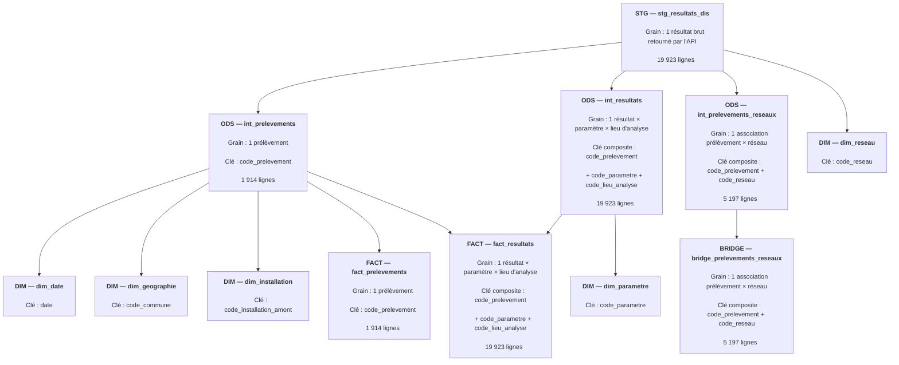
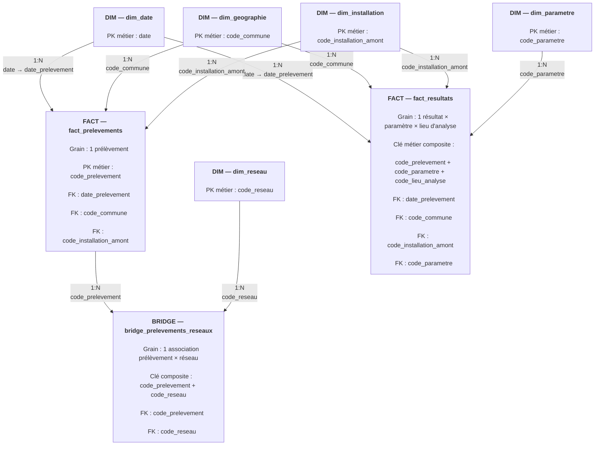

# Schéma analytique du pipeline Hub'Eau

## 1. Objectif

Ce document présente l'architecture de transformation des données du projet Hub'Eau, depuis la couche de staging jusqu'au modèle analytique final.

Il documente notamment :

- les dépendances entre les modèles dbt ;
- le grain métier de chaque modèle ;
- les clés utilisées pour identifier et relier les données ;
- les relations et cardinalités entre les tables analytiques ;
- le rôle de la table de pont dans la relation plusieurs-à-plusieurs entre les prélèvements et les réseaux.

L'objectif est de rendre explicites les choix de modélisation réalisés avant l'exploitation des données dans Power BI.

---

## 2. Flux de transformation dbt



### Lecture du diagramme

La couche **STG** conserve les données issues du RAW sans modifier leur grain.

La couche **ODS** sépare ensuite trois objets métier :

- les prélèvements ;
- les résultats d'analyse ;
- les associations entre prélèvements et réseaux.

Cette séparation permet de construire les dimensions et tables de faits sans introduire de duplication artificielle.

Les flèches de ce premier diagramme représentent les **dépendances de transformation dbt** entre les modèles. Elles ne représentent pas encore les relations PK/FK du futur modèle Power BI.

---

## 3. Modèle analytique final

Le diagramme suivant représente les relations entre les dimensions, les tables de faits et la table de pont.

Contrairement au diagramme précédent, les relations représentées ici correspondent aux **relations analytiques entre les tables** et non aux dépendances de transformation dbt.



### Relation prélèvement ↔ réseau

La relation métier entre les prélèvements et les réseaux est une relation **plusieurs-à-plusieurs (N:N)** :

- un prélèvement peut être associé à plusieurs réseaux ;
- un réseau peut être associé à plusieurs prélèvements.

Ajouter directement `code_reseau` à `fact_prelevements` nécessiterait donc de répéter un même prélèvement pour chacun de ses réseaux et casserait son grain :

> **1 ligne = 1 prélèvement**

La table `bridge_prelevements_reseaux` fait littéralement le **pont** entre les prélèvements et les réseaux et permet de résoudre cette relation N:N :

```text
fact_prelevements
        1
        │
        │ 1:N
        ▼
bridge_prelevements_reseaux
        ▲
        │ 1:N
        │
        1
dim_reseau
```

Ainsi, la relation métier globale reste :

> **fact_prelevements N:N dim_reseau**

mais elle est matérialisée dans le modèle analytique par deux relations :

- `fact_prelevements.code_prelevement` **1:N** `bridge_prelevements_reseaux.code_prelevement`
- `dim_reseau.code_reseau` **1:N** `bridge_prelevements_reseaux.code_reseau`

Cette modélisation évite la duplication des prélèvements et préserve le grain des tables de faits.

---

## 4. Relations et cardinalités du modèle analytique

Le tableau suivant formalise les relations entre les tables du modèle analytique.

Les clés indiquées comme **PK métier** correspondent à des clés dont l'unicité est garantie par la logique de modélisation et les tests dbt. Elles ne correspondent pas nécessairement à des contraintes physiques `PRIMARY KEY` déclarées dans BigQuery.

| Table côté 1 | PK métier | Cardinalité | Table côté N | FK | Rôle analytique |
|---|---|---|---|---|---|
| `dim_date` | `date` | 1:N | `fact_prelevements` | `date_prelevement` | Analyse temporelle des prélèvements |
| `dim_date` | `date` | 1:N | `fact_resultats` | `date_prelevement` | Analyse temporelle des résultats |
| `dim_geographie` | `code_commune` | 1:N | `fact_prelevements` | `code_commune` | Analyse géographique des prélèvements |
| `dim_geographie` | `code_commune` | 1:N | `fact_resultats` | `code_commune` | Analyse géographique des résultats |
| `dim_installation` | `code_installation_amont` | 1:N | `fact_prelevements` | `code_installation_amont` | Analyse des prélèvements par installation |
| `dim_installation` | `code_installation_amont` | 1:N | `fact_resultats` | `code_installation_amont` | Analyse des résultats par installation |
| `dim_parametre` | `code_parametre` | 1:N | `fact_resultats` | `code_parametre` | Analyse des mesures par paramètre |
| `fact_prelevements` | `code_prelevement` | 1:N | `bridge_prelevements_reseaux` | `code_prelevement` | Association des prélèvements aux réseaux |
| `dim_reseau` | `code_reseau` | 1:N | `bridge_prelevements_reseaux` | `code_reseau` | Identification des réseaux associés aux prélèvements |

### Relation métier plusieurs-à-plusieurs

La relation entre `fact_prelevements` et `dim_reseau` est conceptuellement une relation **N:N** :

```text
fact_prelevements N:N dim_reseau

---

## 5. Principales décisions de modélisation

Cette section synthétise les principales décisions prises lors de l'exploration et de la modélisation des données Hub'Eau.  
L'objectif est de documenter les choix ayant conduit à la structure actuelle du modèle analytique.

### 5.1 Séparation entre prélèvements et résultats

Les données Hub'Eau contiennent plusieurs résultats d'analyse pour un même prélèvement.

Deux grains distincts ont donc été modélisés :

- `fact_prelevements` : **1 ligne = 1 prélèvement** ;
- `fact_resultats` : **1 ligne = 1 résultat d'un paramètre donné, pour un prélèvement donné et un lieu d'analyse donné**.

Cette séparation évite de répéter les informations propres au prélèvement, notamment les indicateurs de conformité, pour chaque résultat d'analyse.

---

### 5.2 `reference_analyse` n'est pas utilisée comme clé du résultat

L'exploration des données a montré que `reference_analyse` :

- peut être `NULL` ;
- n'est pas unique au niveau des résultats ;
- peut être partagée par plusieurs paramètres d'un même prélèvement.

Elle est donc conservée comme information issue de la source, mais n'est pas utilisée pour identifier une ligne de `fact_resultats`.

Sur le périmètre étudié, le grain du résultat est identifié par la combinaison :

`code_prelevement + code_parametre + code_lieu_analyse`

Cette unicité est contrôlée par un test dbt dédié.

---

### 5.3 Conservation du lieu d'analyse dans le grain du résultat

La combinaison `code_prelevement + code_parametre` n'est pas suffisante pour identifier systématiquement un résultat.

Un même paramètre peut être analysé plusieurs fois pour un même prélèvement dans des lieux d'analyse différents.

`code_lieu_analyse` est donc conservé dans le grain de `fact_resultats`.

---

### 5.4 Séparation entre résultats numériques et représentation source

`resultat_numerique` n'est pas suffisant pour représenter tous les résultats d'analyse.

Certaines observations sont notamment exprimées sous forme de valeurs censurées, par exemple `<0,10`, ou de valeurs non mesurées telles que `N.M.`.

Le modèle conserve donc conjointement :

- `resultat_alphanumerique` ;
- `resultat_numerique` ;
- `operateur_resultat` ;
- `seuil_resultat`.

Cette approche évite d'interpréter artificiellement une valeur censurée comme une mesure numérique exacte.

---

### 5.5 Limites et références de qualité conservées au grain du résultat

Les limites et références de qualité ne sont pas considérées comme de simples attributs fixes de `dim_parametre`.

L'exploration a notamment montré qu'un même paramètre peut être associé à plusieurs seuils selon les observations.

Les expressions sources ainsi que leurs bornes structurées sont donc conservées dans `fact_resultats`.

Les **limites de qualité** et les **références de qualité** restent également séparées afin de ne pas fusionner deux notions distinctes présentes dans les données sources.

---

### 5.6 Les réseaux ne sont pas éclatés dans les tables de faits

Le champ `reseaux` de la source peut contenir plusieurs réseaux pour un même prélèvement.

L'éclater directement dans `fact_prelevements` ou `fact_resultats` provoquerait une duplication des lignes et modifierait leur grain.

Les associations prélèvement-réseau sont donc isolées dans :

`bridge_prelevements_reseaux`

La relation métier **N:N** entre prélèvements et réseaux est ainsi représentée sans compromettre le grain des tables de faits.

---

### 5.7 Le débit réseau n'est pas utilisé comme facteur de pondération

L'exploration du champ `debit` associé aux réseaux n'a pas permis de l'interpréter de manière suffisamment fiable comme un poids de répartition d'un prélèvement entre plusieurs réseaux.

Il n'est donc pas utilisé pour pondérer les concentrations ou les indicateurs analytiques.

Cette décision évite d'introduire une hypothèse métier non démontrée dans les calculs.

---

### 5.8 Gestion des variantes historiques de noms de réseau

Plusieurs libellés peuvent être observés pour un même `code_reseau`.

`dim_reseau` utilise donc `code_reseau` comme clé métier et conserve les différentes variantes de nom observées, plutôt que de sélectionner arbitrairement un libellé comme référence.

Cette logique explique également pourquoi `dim_reseau` récupère ses informations descriptives depuis le tableau `reseaux` de la couche STG, tandis que le bridge utilise les associations déjà fiabilisées dans `int_prelevements_reseaux`.

---

### 5.9 Conformité conservée au grain du prélèvement

Les indicateurs de conformité sanitaire concernent le prélèvement dans son ensemble et sont donc portés par `fact_prelevements`.

La conclusion textuelle est conservée telle qu'elle est fournie par la source.

Les codes structurés de conformité sont également conservés sans transformer arbitrairement l'ensemble de leurs valeurs en indicateur booléen.

Cette approche permet de préserver l'information source avant la définition des futurs KPI dans la couche de restitution.

---

### 5.10 Séparation entre transformation et modèle analytique

Les modèles intermédiaires (`int_*`) ont pour rôle de structurer, contrôler et fiabiliser les objets métier issus du staging.

Les modèles `dim_*`, `fact_*` et `bridge_*` constituent ensuite la couche analytique destinée à l'exploitation des données.

Cette séparation permet notamment de distinguer :

- la préparation et la fiabilisation des données ;
- la définition des grains métier ;
- la construction des dimensions ;
- l'exposition des faits et relations nécessaires à l'analyse.
