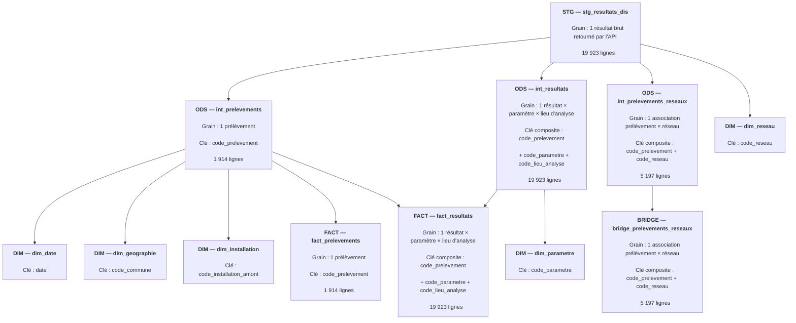
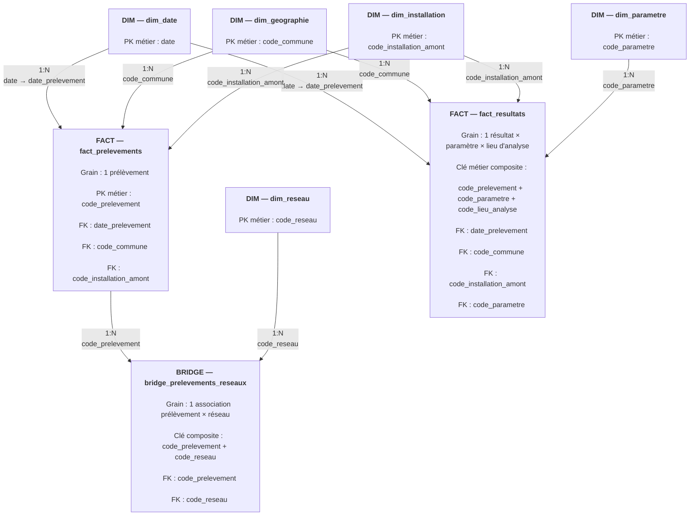

# Schéma analytique du pipeline Hub'Eau

## 1. Objectif

Ce document présente l'architecture de transformation des données du projet Hub'Eau, depuis la couche de staging jusqu'au modèle analytique final.

Il documente notamment :

- les dépendances entre les modèles dbt ;
- le grain métier de chaque modèle ;
- les clés utilisées pour identifier et relier les données ;
- les relations et cardinalités entre les tables analytiques ;
- le rôle de la table de pont dans la relation plusieurs-à-plusieurs entre les prélèvements et les réseaux.

L'objectif est de rendre explicites les choix de modélisation réalisés avant l'exploitation des données dans Power BI.

---

## 2. Flux de transformation dbt



### Lecture du diagramme

La couche **STG** conserve les données issues du RAW sans modifier leur grain.

La couche **ODS** sépare ensuite trois objets métier :

- les prélèvements ;
- les résultats d'analyse ;
- les associations entre prélèvements et réseaux.

Cette séparation permet de construire les dimensions et tables de faits sans introduire de duplication artificielle.

Les flèches de ce premier diagramme représentent les **dépendances de transformation dbt** entre les modèles. Elles ne représentent pas encore les relations PK/FK du futur modèle Power BI.

---

## 3. Modèle analytique final

Le diagramme suivant représente les relations entre les dimensions, les tables de faits et la table de pont.

Contrairement au diagramme précédent, les relations représentées ici correspondent aux **relations analytiques entre les tables** et non aux dépendances de transformation dbt.



### Relation prélèvement ↔ réseau

La relation métier entre les prélèvements et les réseaux est une relation **plusieurs-à-plusieurs (N:N)** :

- un prélèvement peut être associé à plusieurs réseaux ;
- un réseau peut être associé à plusieurs prélèvements.

Ajouter directement `code_reseau` à `fact_prelevements` nécessiterait donc de répéter un même prélèvement pour chacun de ses réseaux et casserait son grain :

> **1 ligne = 1 prélèvement**

La table `bridge_prelevements_reseaux` fait littéralement le **pont** entre les prélèvements et les réseaux et permet de résoudre cette relation N:N :

```text
fact_prelevements
        1
        │
        │ 1:N
        ▼
bridge_prelevements_reseaux
        ▲
        │ 1:N
        │
        1
dim_reseau
```

Ainsi, la relation métier globale reste :

> **fact_prelevements N:N dim_reseau**

mais elle est matérialisée dans le modèle analytique par deux relations :

- `fact_prelevements.code_prelevement` **1:N** `bridge_prelevements_reseaux.code_prelevement`
- `dim_reseau.code_reseau` **1:N** `bridge_prelevements_reseaux.code_reseau`

Cette modélisation évite la duplication des prélèvements et préserve le grain des tables de faits.
